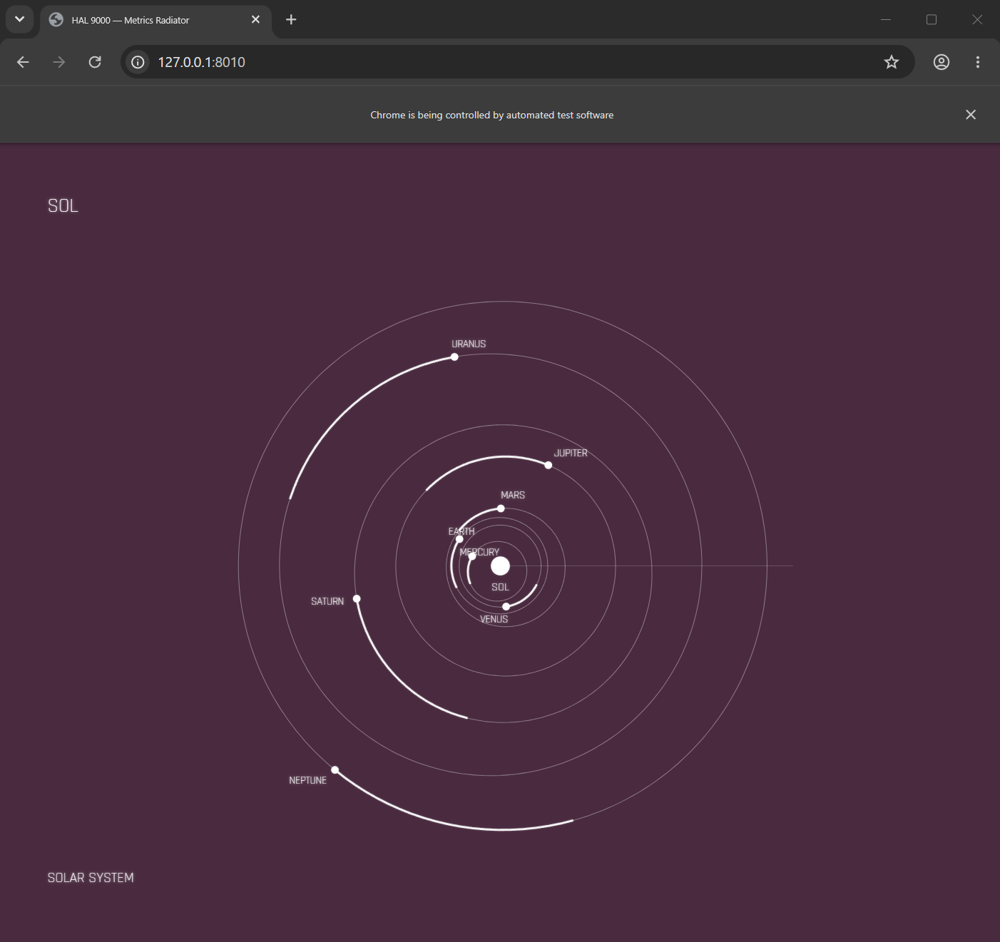

# HAL Radiator

A config-driven single-page application that cycles through animated metric visualizations in the style of the HAL 9000 computer from *2001: A Space Odyssey*. Rendered as pure SVG with no canvas, no WebGL, no external rendering libraries.

The objective is to provide a HAL 9000-like way of presenting real-world metrics along with ones that just look cool. Systems like Grafana are great
metrics presenters, but are often complicated by toggles, switches, etc, and the HAL 9000 was an example of a simpler way to simply cycle through
the boring day-to-day things that someone may be interested in, but not specifically.

This project is also an experiment for myself with using AI to almost completley code such an application. While I have altered a few bits to save endless loops with an agent, 98% of this projects code is AI authored, primarily by Hermes agent using DeepSeek v4 Flash. Hermes was chosen instead of an explicit coding agent for many tasks because much of the work was esoteric, not directly codable, and I wanted to see how well it would do.

Feel free to fork, copy, steal, whatever you like, but you cannot use it for profit of any kind as the source is copyrighted, and the derivative work that this was built on took a lot more work and dedication than I have put into this.

   **[Live Demo](https://cyrusjk.github.io/hal-radiator/)**

This is very much in an _EXPERIMENTAL/ALPHA_ phase, as in there are inconsistencies, test cards, things that are out of alignment, etc. Feel free to come up with improvments, but this is very much a side project for me at this time, and I have not bean able to give it full attention.

## Credits and Gratitudes

Models and color palette sourced from the [HAL Project Gallery ](https://ko-fi.com/joecreative/gallery) and [YouTube](https://www.youtube.com/channel/UC19EGSO3O3DC7KHYgGo5zxg) by JoeCreative. Much of the work done here used that project as source material and I have put only a fraction of the amount of work into this project than they have put into theirs. Visual design, animation timing, and typography derived from the HAL 9000 display panel as depicted in [*2001: A Space Odyssey*](https://en.wikipedia.org/wiki/2001:_A_Space_Odyssey) (1968, MGM). This project stands on the shoulders of that work and makes no claim of originality for the aesthetic. Font files are licensed separately.

## Quick Start

```bash
# View the live demo
open https://cyrusjk.github.io/hal-radiator/

# Or run locally (self-contained, no external APIs needed)
python generate-demo-data.py
python serve.py
open http://127.0.0.1:8009
```

The demo uses synthetic inline data. For a live system with real metrics, point `radiator.yaml` at a VictoriaMetrics or Prometheus instance (see [Configuration](#configuration)).

## How It Works

```
  radiator.yaml ──→ build.py ──→ src/config.js ──→ dist/index.html
                                                       │
  serve.py ──→ /api/config (JSON) ──→ browser ──→ app.js
                                                    │
                                              showCard()
                                               │      │
                                        fetcher.js  animation-engine.js
                                               │      │
                                        card renderer ──→ SVG in #card
                                                          │
                                                    auto-timer → next card
```

### Pipeline

| Layer | File(s) | Role |
|-------|---------|------|
| **Config** | `radiator.yaml` | Card definitions, timing, color palette, data source config |
| **Prototypes** | `prototypes.yaml` | Reusable card templates (orbital, curve-family, polar, etc.) |
| **Build** | `build.py` | Merges YAML → `src/config.js`, inlines everything into `dist/index.html` |
| **Server** | `serve.py` | Serves `/api/config` as JSON + static files, ERA5 data cache |
| **Boot** | `src/app.js` | Fetches config, cycles cards via auto-timer |
| **Data** | `src/data/fetcher.js`, `src/data/sources/` | Fetches from VictoriaMetrics, ERA5, or inline YAML data |
| **Renderers** | `src/cards/*.js` | 15 card types, each building SVG for a specific visualization |
| **Animation** | `src/animation-engine.js` | Phase-based sequence engine: flickerIn, draw, wait, done |
| **Utilities** | `src/svg-utils.js` | SVG element helpers, color/scale functions |

### Card Types

| Type | File | Description |
|------|------|-------------|
| title | `title.js` | Static title card with subtitle |
| curve-family | `curve-family.js` | Multi-series time-series chart (CPU, network, load) |
| curve-family-stacked | `curve-family-stacked.js` | Stacked area time-series |
| curve-family-3d | `curve-family-3d.js` | 3D-perspective curve chart |
| orbital | `orbital.js` | Planetary orbit diagrams (JOV, LUN, SOL, JOV2) |
| trajectory | `trajectory.js` | Voyager trajectory overlay with zoom panel |
| sunburst | `sunburst.js` | Radial hierarchy chart |
| streamgraph | `streamgraph.js` | Stacked stream graph |
| edge-bundling | `edge-bundling.js` | Hierarchical edge bundling |
| polar | `polar.js` | Radial/angular data charts |
| tabular | `tabular.js` | Data table |
| telemetry-grid | `telemetry-grid.js` | Grid of telemetry readouts |
| wireframe | `wireframe.js` | 3D wireframe visualization |
| dock-stack | `dock-stack.js` | 3D stack card animation |
| composite | `composite.js` | Multi-zone composite layout |

## Configuration

### radiator.yaml

Cards are defined in `radiator.yaml` under `groups:`:

```yaml
- charts:
    - chartType: trajectory
      title: VOYAGER
      label: INTERSTELLAR
      color: '#0f1923'
      dataSource:
        type: inline
        trajectories:
          - label: V1
            style: solid
            waypoints:
              - { angle: 106.4, r: 1.01 }
              ...

    - color: plum
      dataSource:
        promql: 'rate(node_network_bytes_total[2m])'
        range: 3600
        type: victoria
        url: *vm_url
      prototype: curve-family-default
      title: THR
```

### Data Sources

| Type | Plugin | Description |
|------|--------|-------------|
| `inline` | `inline.js` | Data embedded directly in YAML (groups/series format) |
| `victoria` | `victoria.js` | VictoriaMetrics PromQL queries |
| `era5` | `era5.js` | ERA5 climate reanalysis data |
| `orbital` | `orbital.js` | Static orbital elements (Keplerian) |

### Demo vs Live

| | Demo (`radiator-demo.yaml`) | Live (`radiator.yaml`) |
|---|---|---|
| **Data** | Synthetic inline data | Real metrics from VictoriaMetrics |
| **Dependencies** | None (self-contained) | VictoriaMetrics at configured URL |
| **Build** | `python generate-demo-data.py` | `python build.py` |
| **Use case** | GitHub Pages, testing, offline | Production monitoring |

## Animation Engine

The animation engine runs a sequence of phases for each card:

```
header+footer flickerIn → SOL flickerIn → planets flickerIn (simultaneous)
→ V1 trajectory draws (stroke-dashoffset animation) → wait → done
```

Phase types:

- **flickerIn** — Elements fade in via CSS animation (`blink-in` class)
- **flickerOut** — Elements fade out
- **appear** — Elements snap to full opacity
- **disappear** — Elements snap to zero opacity
- **draw** — Path elements revealed via stroke-dashoffset animation
- **wait** — Configurable pause
- **done** — Signals card completion, triggering auto-timer

Order can be `simultaneous`, `sequential`, or `oneByOne` with configurable gap timing.

## Development

```bash
# Build
python build.py

# Serve
python serve.py

# Tests
npx vitest run

# Generate demo data
python generate-demo-data.py
```

### Architecture

See [docs/architecture.html](docs/architecture.html) for a visual architecture diagram.

### Data Contract

See [DATA_CONTRACT.md](DATA_CONTRACT.md) for the expected data shape per card type.

## License

[Non-Commercial License](LICENSE) — You may copy, modify, distribute, and use this project for any non-commercial purpose. Commercial use requires permission. No attribution required.

Font files in `assets/fonts/` are licensed separately under their own terms.
